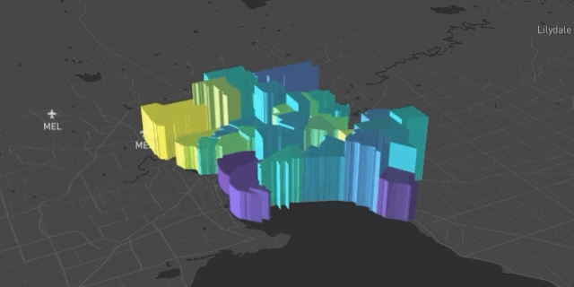
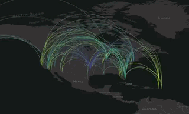

<!-- README.md is generated from README.Rmd. Please edit that file -->

# mapdeck

[](https://github.com/SymbolixAU/mapdeck/actions)
[](https://codecov.io/gh/symbolixau/mapdeck?branch=master)
[](https://CRAN.R-project.org/package=mapdeck)

[](https://CRAN.R-project.org/package=mapdeck)
[](https://github.com/SymbolixAU/mapdeck)


## What is mapdeck?

An R library which lets you plot large data sets (as much as your GPU &
browser can handle), on interactive maps using Mapbox GL and Deck.gl



## What is mapbox?

> Mapbox is the location data platform for mobile and web applications.
> We provide building blocks to add location features like maps, search,
> and navigation into any experience you create.

  - <https://www.mapbox.com/about/>

## What is deck.gl?

> deck.gl is a WebGL-powered framework for visual exploratory data
> analysis of large datasets.

  - <https://deck.gl/#/>

## How do I use it?

First you need to install it, either from CRAN

``` r
install.packages("mapdeck")
```

Or from github (to get the latest development version)

``` r
devtools::install_github("SymbolixAU/mapdeck")
```

Then everything you need to know to get you started is on the [home
page](https://symbolixau.github.io/mapdeck/articles/mapdeck.html)

## Quick Start

Mapdeck uses [Mapbox maps](https://www.mapbox.com/), and to use Mapbox
you need an [access
token](https://docs.mapbox.com/help/how-mapbox-works/access-tokens/).

Once you’ve generate a token you can use their maps.

Call `mapdeck(token = 'your_token')` to generate a basic map. Then start
adding layers by using one of the various `add_*()` functions.

``` r
url <- 'https://raw.githubusercontent.com/plotly/datasets/master/2011_february_aa_flight_paths.csv'
flights <- read.csv(url)
flights$info <- paste0("<b>",flights$airport1, " - ", flights$airport2, "</b>")

mapdeck(token = key, style = mapdeck_style('dark')) %>%
  add_arc(
    data = flights
    , origin = c("start_lon", "start_lat")
    , destination = c("end_lon", "end_lat")
    , stroke_from = "airport1"
    , stroke_to = "airport2"
    , tooltip = "info"
    , layer_id = 'arclayer'
  )
```



See the
[Layers](https://symbolixau.github.io/mapdeck/articles/layers.html) page
for more examples

## Getting help

For general help and advice the best place to ask is on
[StackOverflow](https://stackoverflow.com/questions/tagged/mapdeck)
(using the `mapdeck` tag).

If you’ve found a bug, or want a new feature added then use the [issue
tracker](https://github.com/SymbolixAU/mapdeck/issues) on github.

I don’t respond to emails asking for help because this is an open source
package, and any advice should be kept open so everyone can benefit.
(unless you want to pay me\!)
