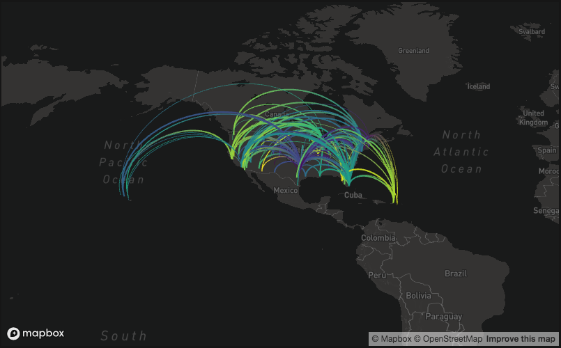

# mapdeck

[](http://cran.r-project.org/package=mapdeck)

[](http://cran.r-project.org/web/packages/mapdeck/index.html)
[](https://github.com/SymbolixAU/mapdeck)
[](https://travis-ci.org/SymbolixAU/mapdeck)
[](https://codecov.io/github/SymbolixAU/mapdeck?branch=master)

Interactive maps using Mapbox GL and Deck.gl

## Installation

```r
devtools::install_github("SymbolixAU/mapdeck")
```



## Available Plots

Most of these plots are avialble in a limited capacity. I haven't implemented all attributes (fill, strokes, widths, elevations)

- Arc
- GeoJSON
- Grid
- Line
- Path (partial - uses encoded polylines)
- Polygon (partial - uses encoded polylines)
- Scatter
- ScreenGrid

## TODO

- Hexagon
- Icon
- PointCloud
- Text

## Shiny

Basic plots work in shiny, but I'm still working on the interactive updates
