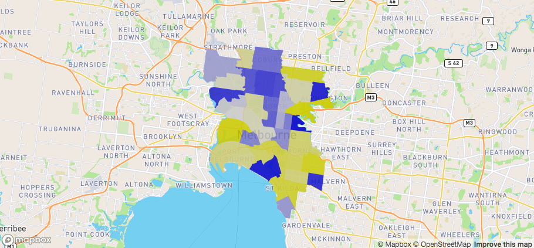
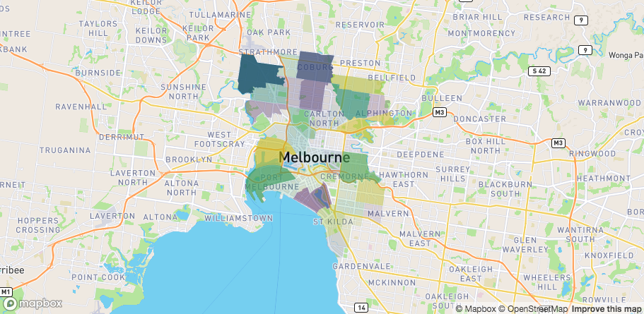
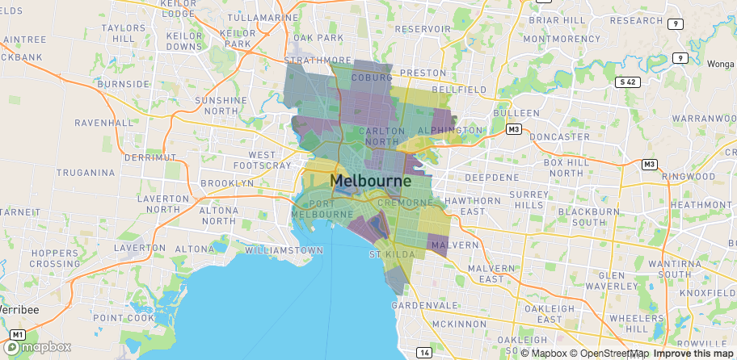
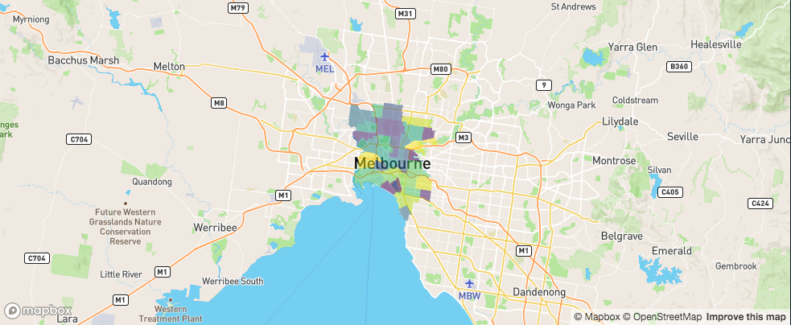
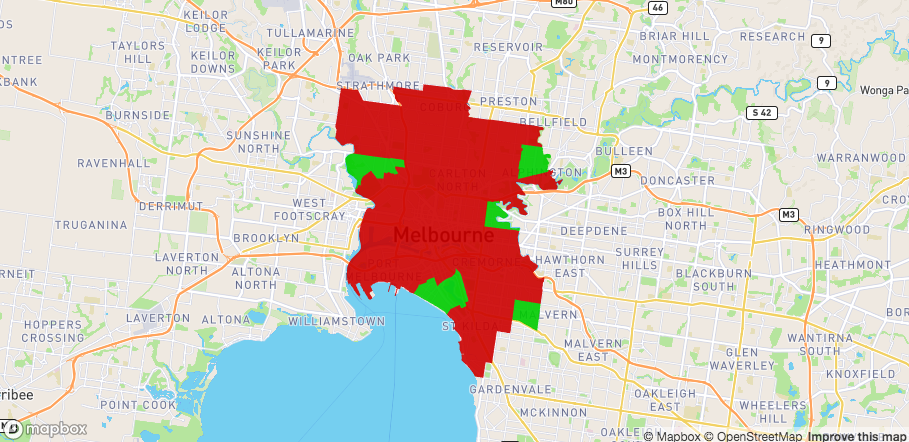

# Colours

The easiest way to colour your data is to pass the column of your `data` you want coloured to either the `stroke_colour` or `fill_colour` argument (depending on the layer you're using).

## fill and stroke

For this demonstration I'm using a simple feature `sf` object of polygons denoting various regions in Melbourne (taken from the `spatialwidget` library)

```{r}
library(mapdeck)
library(sf)

sf <- spatialwidget::widget_melbourne
sf
```

This first map is simply showing the regions coloured according to its name

```r
mapdeck() %>%
  add_polygon(
    data = sf
    , fill_colour = "SA2_NAME"
  )
```


The colour scheme defaults to viridis. You can change it with the `palette` argument by using one of the other palettes available in `library(colourvalues)`

```{r}
## to see a list of colours
## colourvalues::colour_palettes()

## plot of colours
colourvalues::show_colours()
```


or by using a matrix palette.

```r
## using another viridis colour palette

mapdeck() %>%
  add_polygon(
    data = sf
    , fill_colour = "SA2_NAME"
    , palette = "inferno"
  )
```


```r
m <- grDevices::colorRamp(c("blue", "white", "yellow"))( (1:256)/256 )

mapdeck() %>%
  add_polygon(
    data = sf
    , fill_colour = "SA2_NAME"
    , palette = m
  )

```


## Opacity

You can change the transparency of the colours by specifying a numeric column of data to either `fill_opacity` or `stroke_opacity`

```r
mapdeck() %>%
  add_polygon(
    data = sf
    , fill_colour = "SA2_NAME"
    , fill_opacity = "AREASQKM"
  )
```  


Or by using a single value between 1 & 255 to apply to all the shapes

```r
mapdeck() %>%
  add_polygon(
    data = sf
    , fill_colour = "SA2_NAME"
    , fill_opacity = ( 255 / 2 )
  )
```  



## How it works

The colouring is performed by the [`colourvalues`](https://github.com/symbolixau/colourvalues) library. Feel free to browse the documentation and code if you want a deeper understanding. 

But broadly speaking, when you supply a vector to `colour_values()`, it returns a vector of colours scaled according to the data

```{r}
colourvalues::colour_values(1:10)
```

Here you should see the values `1:10` get coloured according to the palette you supply (the default is "viridis"). The colours are also automatically ordered against your data. So if we reverse the vector

```{r}
colourvalues::colour_values(10:1)
```

You can see the colour assigned to `1` is the same in both cases. 

The same is true when using different palettes

```{r}
colourvalues::colour_values(c(1:10,10:1), palette = "inferno")

m <- grDevices::colorRamp(c("blue", "white", "yellow"))( (1:256)/256 )
colourvalues::colour_values(c(1:10,10:1), palette = m)
```

See how the colours are mirrored to reflect the data.

The same ordering applies to characters, factors, dates, etc. In this example I'm colouring the letters "j" through to "a" (in the English alphabet). The colour assigned to "a" is the same as that applied to 1.

```{r}
colourvalues::colour_values(letters[10:1])
```

### Vectors vs scalar opacity

There is a difference in behaviour when you supply a vector for the opacity values compared to when you use a single value.

See how these two lines produce different results

```{r}
colourvalues::colour_values(x = rep(1,5), alpha = rep(255,5))

colourvalues::colour_values(x = rep(1,5), alpha = 255)
```

This is because one uses a vector for the opacity, where all the values are 255, and the other is because a single value of 255 is used as the opacity.

Lke with colours, when you supply a vector for the opacity, `colourvalues` treats each element relative to the other elements and maps the opacity accordingly. 

It does this by rescaling the values in the vector to be in [0,1] (source code is [here](https://github.com/SymbolixAU/colourvalues/blob/master/inst/include/colourvalues/scale/scale.hpp#L37) if you want to look), then multiplies by 255. 

The [0,255] values are then the actual opacities. 

So in this example, since every value of the vector is the same, they all get scaled to zero, which is the most transparent opacity.

Here are the result in action.

```{r, eval = FALSE}

library(sf)
library(spatialwidget)
sf <- spatialwidget::widget_melbourne
sf$opacity <- 150

mapdeck() %>%
  add_polygon(
    data = sf
    , fill_colour = "SA2_NAME"
    , fill_opacity = "opacity"
  )

```


The polygons are completely tranparent. Now if I use a single value of 150, rather than a vector, we get the desired opacity.

```{r, eval = FALSE}

library(sf)
library(spatialwidget)
sf <- spatialwidget::widget_melbourne
sf$opacity <- 150

mapdeck() %>%
  add_polygon(
    data = sf
    , fill_colour = "SA2_NAME"
    , fill_opacity = 150
    , stroke_colour = "SA2_NAME"
  )

```


## Manual colours

If you want finer control over the colours, you can add a column of colours to your data, specified as a hex string.

Here I'm setting all the polygons which begin with `A` as green, and the rest as red

```r
sf$my_colour <- ifelse( substr(sf$SA2_NAME, 1, 1) == "A", "#00FF00FF", "#FF0000FF")

mapdeck( ) %>%
  add_polygon(
    data = sf
    , fill_colour = "my_colour"
  )

```



Setting `legend = TRUE` in this example will just show the legend with the hex-strings, which probably isn't what you're after. In this case you can also create a manual legend, which I've described over on the [legends article](https://symbolixau.github.io/mapdeck/articles/legends.html#manual-legends)


## colour_range

Some layers use a `colour_range` argument instead of fill and stroke. For these layers you need to use a vector of 6 hex strings. These also default to the viridis palette.

```r
sf_outer <- sf::st_convex_hull( sf::st_union( sf ) )
sf_sample <- sf::st_sample( sf_outer, size = 10000 )
sf_sample <- sf::st_sf( geometry = sf_sample )

mapdeck() %>%
	add_hexagon(
		data = sf_sample
		, colour_range = colourvalues::colour_values(1:6, palette = "plasma")
		, elevation_scale = 10
	)

```


## GeoJSON

Colouring geojson is a bit different to other layers. 

If your geojson has a `properties` field, and within that field you have one of 

- `fill_colour` / `stroke_colour`
- `fillColour` / `strokeColour`
- `fill_color` / `stroke_color`
- `fillColor` / `strokeColor`

these will be automatically used and plotted


```{r}
substr( mapdeck::geojson, 1, 200) 
```

```r
mapdeck( location = c(145, -37.8), zoom = 10) %>%
	add_geojson(
		data = mapdeck::geojson
	)

```


This is the quickest way of getting your data [from R to javascript](https://symbolixau.github.io/mapdeck/articles/benchmarks.html)


If your GeoJSON doesn't contain those colour fields, or if you want to use a different property for colours, you can do so, but it will be a bit slower as it has to convert the geojson to an `sf` object first, sort out the colours, then back to GeoJSON

```r
mapdeck( location = c(145, -37.8), zoom = 10) %>%
	add_geojson(
		data = mapdeck::geojson
		, fill_colour = "id"
		, radius = 300
	)
```


