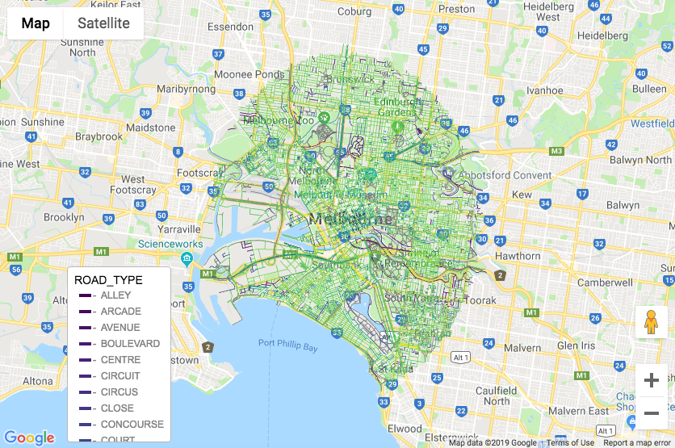

```{r setup, include = FALSE}
knitr::opts_chunk$set(
  collapse = TRUE,
  comment = "# ",
  eval = F
)
```

```
library(mapdeck)
library(googleway)
```


As of version 0.2.2 you can add `mapdeck` layers to a `googleway` Google Map. 

### How, you ask?

Very simple. You add Mapdeck's dependencies to the map

```r

googleway::google_map() %>%
  mapdeck::add_dependencies()
```

Then you can add any of the layers


```r
googleway::google_map() %>%
  mapdeck::add_dependencies() %>%
	mapdeck::add_path(
		data = roads
		, stroke_colour = "ROAD_TYPE"
		, legend = T
	)

```


If you're using `shiny` you also need to add `mapdeck_dependencies()` to the UI

```r

library(shiny)
library(shinydashboard)
library(mapdeck)
library(googleway)

ui <- dashboardPage(
	
	dashboardHeader(),
	dashboardSidebar(),
	dashboardBody(
	  mapdeck::mapdeck_dependencies()
		, box(
		  width = 12
		  , google_mapOutput(
		    outputId = "map"
		    , height = "600"
		    )
		)
	)
)

server <- function(input, output) {

	#set_key("GOOGLE_KEY")
	
	output$map <- renderGoogle_map({
		google_map() %>%
			mapdeck::add_dependencies() %>%
			mapdeck::add_path(
				data = mapdeck::roads
				, stroke_width = 10
				, stroke_colour = "ROAD_TYPE"
				, legend = TRUE
			)
	})
}

shinyApp(ui, server)
```

