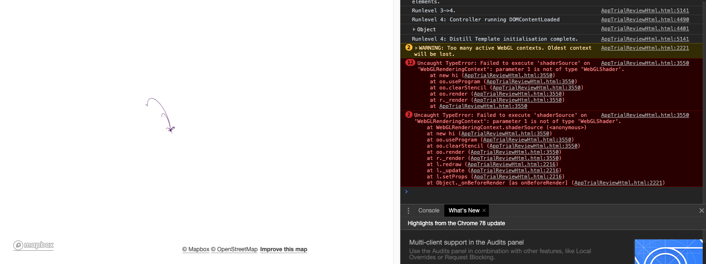

From time to time you may find something not working. If your issue isn't covered on this page, head to the [github issues page](https://github.com/symbolixau/mapdeck/issues), have a look there, and if you can't find a solution feel free to open a new issue

## RStudio viewer is blank 

Try opening in a browser. [Issue 18](https://github.com/SymbolixAU/mapdeck/issues/18)

## Browser is blank

Look at the javascript console for any errors. [Issue 95](https://github.com/SymbolixAU/mapdeck/issues/95)

## Map doesn't zoom to the layer

Are you subsetting an `sf` object without the `sf` library loaded? [See here](file:///Users/dave/Documents/github/mapdeck/docs/articles/tips_tricks.html#sf)

Or are you plotting GeoJSON or an `sfencodedLite` object? The bounding box is not calculated for either of these, so the map doesn't know where to focus

## Map loads but the layer / data doesn't

Do you have `NA`s in your data? Mapdeck will have issues plotting if there are, so it's worth checking.

## Some maps in a document (Rmd, shiny) load, some don't

Maybe you have too many maps loaded. There is a [known issue with Mapbox](https://github.com/mapbox/mapbox-gl-js/issues/7332) where browsers don't support enough WebGL contexts. 

If you inspect your document you may see this error. This indicates you have too many maps. 

