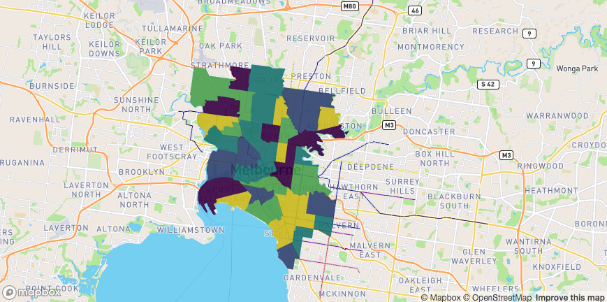
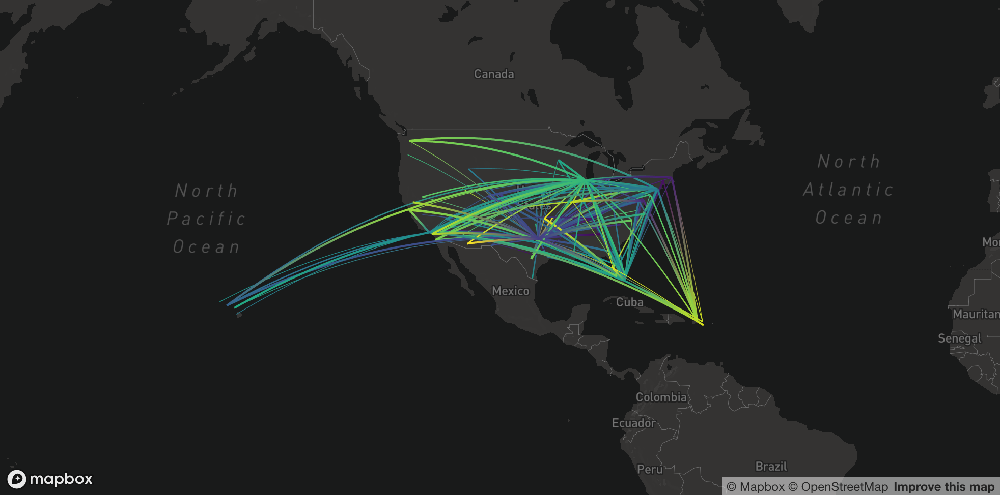
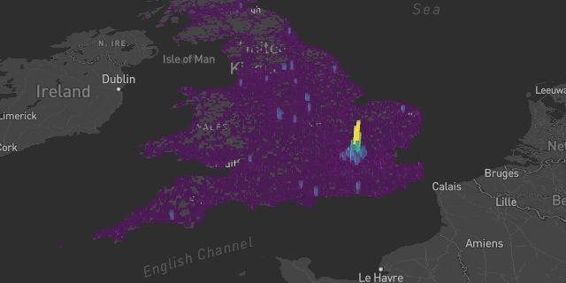
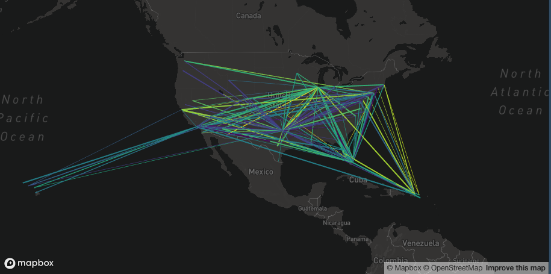
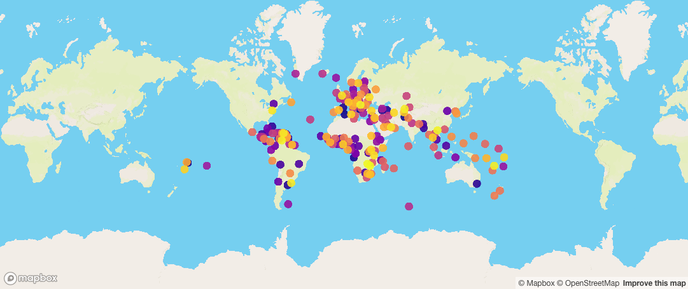

```{r setup, include = FALSE}
knitr::opts_chunk$set(
  collapse = TRUE,
  comment = "# ",
  eval = F
)
```

```{r packages, eval = TRUE, message = FALSE}
library(mapdeck)
```

# Layers


All layers support Simple Feature (from `library(sf)`) objects. 

## layer_id

Each layer requires a `layer_id` value. If you don't supply one, it will create it for you, but this may have some unintended consequences for you. 

The `layer_id` is the ID that `deck.gl` uses to 'shallow-compare' layers to see if they need updating. Which comes in handy when working in Shiny. If you update data, for example when using a `reactive()` function, and use the same `layer_id`, `deck.gl` knows it should update the layer rather than re-draw it completely. 

**However**, if two of your layers have the same `layer_id`, then `deck.gl` will get confused and start updating the wrong thing. So while I've made the `layer_id` argument optional, you should still set it manually when using it in Shiny apps. 

## Arcs

```{r}

url <- 'https://raw.githubusercontent.com/plotly/datasets/master/2011_february_aa_flight_paths.csv'
flights <- read.csv(url)
flights$id <- seq_len(nrow(flights))
flights$stroke <- sample(1:3, size = nrow(flights), replace = T)

mapdeck( token = key, style = 'mapbox://styles/mapbox/dark-v9', pitch = 45 ) %>%
  add_arc(
    data = flights
    , layer_id = "arc_layer"
    , origin = c("start_lon", "start_lat")
    , destination = c("end_lon", "end_lat")
    , stroke_from = "airport1"
    , stroke_to = "airport2"
    , stroke_width = "stroke"
  )
```


**sf** : supports `sf` objects with two POINT or MULTIPOINT geometry columns.


## GeoJSON

```{r}
mapdeck(
  token = key
  , pitch = 35
  ) %>%
	add_geojson(
    data = geojson
    , layer_id = "geojson"
  )
```



**sf** : supports all `sf` geometry types. Converted to geojson using `geojsonsf::sf_geojson()`. Useful if your `sf` object contains different geometry types.

## Great Circles

```{r}

url <- 'https://raw.githubusercontent.com/plotly/datasets/master/2011_february_aa_flight_paths.csv'
flights <- read.csv(url)
flights$id <- seq_len(nrow(flights))
flights$stroke <- sample(1:3, size = nrow(flights), replace = T)

mapdeck( style = 'mapbox://styles/mapbox/dark-v9') %>%
  add_greatcircle(
    data = flights
    , layer_id = "arc_layer"
    , origin = c("start_lon", "start_lat")
    , destination = c("end_lon", "end_lat")
    , stroke_from = "airport1"
    , stroke_to = "airport2"
    , stroke_width = "stroke"
  )
```



**sf** : supports `sf` objects with two POINT or MULTIPOINT geometry columns.

## Grid

```{r}
df <- read.csv(paste0(
'https://raw.githubusercontent.com/uber-common/deck.gl-data/master/',
'examples/3d-heatmap/heatmap-data.csv'
))

df <- df[!is.na(df$lng), ]

mapdeck( token = key, style = mapdeck_style("dark"), pitch = 45 ) %>%
add_grid(
  data = df
  , lat = "lat"
  , lon = "lng"
  , cell_size = 5000
  , elevation_scale = 50
  , layer_id = "grid_layer"
)
```



**sf** : supports `sf` objects with POINT and MULTIPOINT geometries

## Heatmap

```{r}

df <- read.csv(paste0(
'https://raw.githubusercontent.com/uber-common/deck.gl-data/master/',
'examples/3d-heatmap/heatmap-data.csv'
))

df <- df[!is.na(df$lng), ]

mapdeck( style = mapdeck_style('dark'), pitch = 45 ) %>%
 add_heatmap(
   data = df[1:30000, ]
   , lat = "lat"
   , lon = "lng"
   , weight = "weight",
   , colour_range = colourvalues::colour_values(1:6, palette = "inferno")
)

```


## Hexagons

```{r}


library(mapdeck)

set_token( read.dcf("~/Documents/.googleAPI", fields = "MAPBOX"))
df <- read.csv(paste0(
  'https://raw.githubusercontent.com/uber-common/deck.gl-data/master/examples/'
  , '3d-heatmap/heatmap-data.csv'
))

df <- df[!is.na(df$lng), ]

mapdeck( style = mapdeck_style("dark"), pitch = 45) %>%
  add_hexagon(
    data = df[ df$lat > 54.5, ]
    , lat = "lat"
    , lon = "lng"
    , layer_id = "hex_layer"
    , elevation_scale = 100
    , colour_range = colourvalues::colour_values(1:6, palette = colourvalues::get_palette("viridis")[70:256,])
  )


```


## Lines

```{r}
url <- 'https://raw.githubusercontent.com/plotly/datasets/master/2011_february_aa_flight_paths.csv'
flights <- read.csv(url)
flights$id <- seq_len(nrow(flights))
flights$stroke <- sample(1:3, size = nrow(flights), replace = T)

mapdeck( token = key, style = mapdeck_style("dark"), pitch = 45 ) %>%
  add_line(
    data = flights
    , layer_id = "line_layer"
    , origin = c("start_lon", "start_lat")
    , destination = c("end_lon", "end_lat")
    , stroke_colour = "airport1"
    , stroke_width = "stroke"
  )
```



**sf** : supports `sf` objects with two POINT and MULTIPOINT geometry columns.

## Path

```{r}
mapdeck(
  token = key
  , style = mapdeck_style("dark")
  , zoom = 10) %>%
  add_path(
    data = roads
    , stroke_colour = "RIGHT_LOC"
    , layer_id = "path_layer"
  )

```


**sf** : supports `sf` objects with LINESTRING and MULTILINESTRING geometries

## Point cloud

```{r}
df <- capitals
df$z <- sample(10000:10000000, size = nrow(df))

mapdeck(token = key, style = mapdeck_style("dark")) %>%
add_pointcloud(
  data = df
  , lon = 'lon'
  , lat = 'lat'
  , elevation = 'z'
  , layer_id = 'point'
  , fill_colour = "country"
)
```


**sf** : supports `sf` objects with POINT and MULTIPOINT geometries

## Polygons

```{r}
library(sf)
library(geojsonsf)

sf <- geojson_sf("https://symbolixau.github.io/data/geojson/SA2_2016_VIC.json")
sf$e <- sf$AREASQKM16 * 10

mapdeck(token = key, style = mapdeck_style("dark")) %>%
  add_polygon(
    data = sf[ data.table::`%like%`(sf$SA4_NAME16, "Melbourne"), ]
    , layer = "polygon_layer"
    , fill_colour = "SA2_NAME16"
    , elevation = "e"
  )
```


**sf** : supports `sf` objects with POLYGON and MULTIPOLYGON geometries

## Scatter

```{r}

mapdeck( token = key ) %>%
add_scatterplot(
  data = capitals
  , lat = "lat"
  , lon = "lon"
  , radius = 500000
  , fill_colour = "country"
  , layer_id = "scatter_layer"
  , palette = "plasma"
)

```



**sf** : supports `sf` objects with POINT and MULTIPOINT geometries

## Screen grid

```{r}
df <- read.csv(paste0(
'https://raw.githubusercontent.com/uber-common/deck.gl-data/master/',
'examples/3d-heatmap/heatmap-data.csv'
))

df <- df[ !is.na(df$lng), ]

df$weight <- sample(1:10, size = nrow(df), replace = T)

mapdeck( token = key, style = mapdeck_style('dark'), pitch = 45 ) %>%
add_screengrid(
  data = df
  , lat = "lat"
  , lon = "lng"
  , weight = "weight"
  , layer_id = "screengrid_layer"
  , cell_size = 10
  , opacity = 0.3
  , colour_range = colourvalues::colour_values(1:6, palette = "plasma")
)
```


**sf** : supports `sf` objects with POINT and MULTIPOINT geometries

## Text

```{r}
mapdeck(token = key, style = mapdeck_style('dark')) %>%
  add_text(
    data = capitals
    , lon = 'lon'
    , lat = 'lat'
    , fill_colour = 'country'
    , text = 'capital'
    , layer_id = 'text'
    , size = 16
  )
```


**sf** : supports `sf` objects with POINT and MULTIPIONT geometries

## Multiple layers


```{r}

df1 <- capitals[ capitals$country == "Australia", ]
df2 <- capitals[ capitals$country != "Australia", ]
df1$key <- 1L
df2$key <- 1L

df <- merge(df1, df2, by = 'key')

mapdeck(
  token = key
  , style = mapdeck_style("dark")
  , pitch = 35
  ) %>%
  add_arc(
    data = df
    , origin = c("lon.x", "lat.x")
    , destination = c("lon.y", "lat.y")
    , layer_id = "arc_layer"
    , stroke_from = "country.x"
    , stroke_to = "country.y"
    , stroke_width = 2
    ) %>%
	add_scatterplot(
    data = df2
    , lon = "lon"
    , lat = "lat"
    , radius = 100000
    , fill_colour = "country"
    , layer_id = "scatter"
  )


```


# Shiny

The three main functions to use are

1. `renderMapdeck()` in the **Server**
2. `mapdeckOutput()` in the **UI**
3. `mapdeck_update()` to update an existing map

You can observe interactions with the layers by using `observeEvent()`. The event you observe is formed by combining

`'map_id + "_" + layer + "_click"`

where

- `map_id` is the `outputId` of the `mapdeckOutput()` function
- `layer` is the layer you're interacting with
- `_click` is you observing 'clicking' on the layer

There's an example of this in the shiny.

```{r}
library(shiny)
library(shinydashboard)
library(jsonify)

ui <- dashboardPage(
	dashboardHeader()
	, dashboardSidebar()
	, dashboardBody(
		mapdeckOutput(
			outputId = 'myMap'
			),
		sliderInput(
			inputId = "longitudes"
			, label = "Longitudes"
			, min = -180
			, max = 180
			, value = c(-180,-90)
		)
		, verbatimTextOutput(
			outputId = "observed_click"
		)
	)
)
server <- function(input, output) {
	
	#set_token('abc') ## set your access token
	
	origin <- capitals[capitals$country == "Australia", ]
	destination <- capitals[capitals$country != "Australia", ]
	origin$key <- 1L
	destination$key <- 1L
	
	df <- merge(origin, destination, by = 'key', all = T)
	
	output$myMap <- renderMapdeck({
		mapdeck(style = mapdeck_style('dark')) 
	})
	
	## plot points & lines according to the selected longitudes
	df_reactive <- reactive({
		if(is.null(input$longitudes)) return(NULL)
		lons <- input$longitudes
		return(
			df[df$lon.y >= lons[1] & df$lon.y <= lons[2], ]
		)
	})
	
	observeEvent({input$longitudes}, {
		if(is.null(input$longitudes)) return()
		
		mapdeck_update(map_id = 'myMap') %>%
			add_scatterplot(
				data = df_reactive()
				, lon = "lon.y"
				, lat = "lat.y"
				, fill_colour = "country.y"
				, radius = 100000
				, layer_id = "myScatterLayer"
				, update_view = FALSE
			) %>%
			add_arc(
				data = df_reactive()
				, origin = c("lon.x", "lat.x")
				, destination = c("lon.y", "lat.y")
				, stroke_from = "country.x"
				, stroke_to = "country.y"
				, layer_id = "myArcLayer"
				, id = "country.x"
				, stroke_width = 4
				, update_view = FALSE
			)
	})
	
	## observe clicking on a line and return the text
	observeEvent(input$myMap_arc_click, {
		
		event <- input$myMap_arc_click
		output$observed_click <- renderText({
			jsonify::pretty_json( event )
		})
	})
}

shinyApp(ui, server)
```


