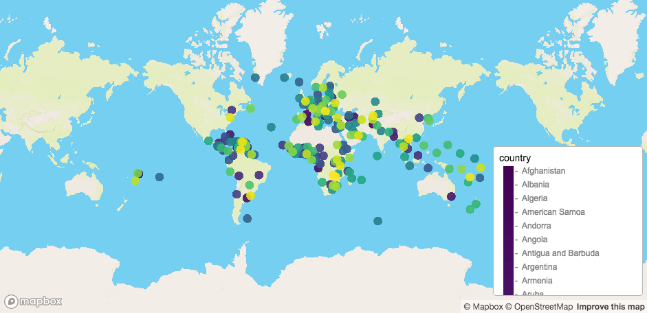
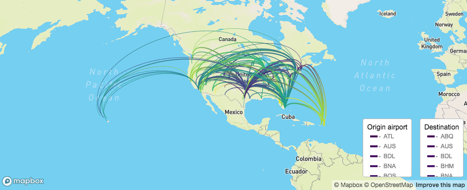
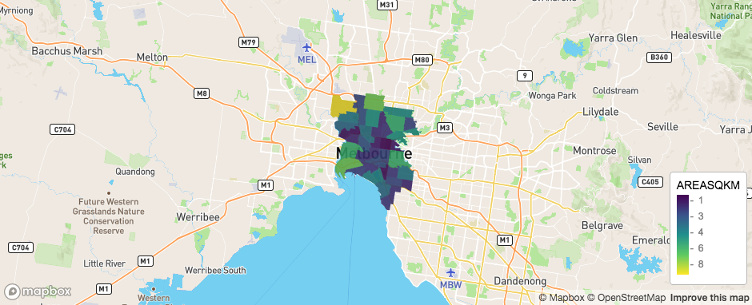
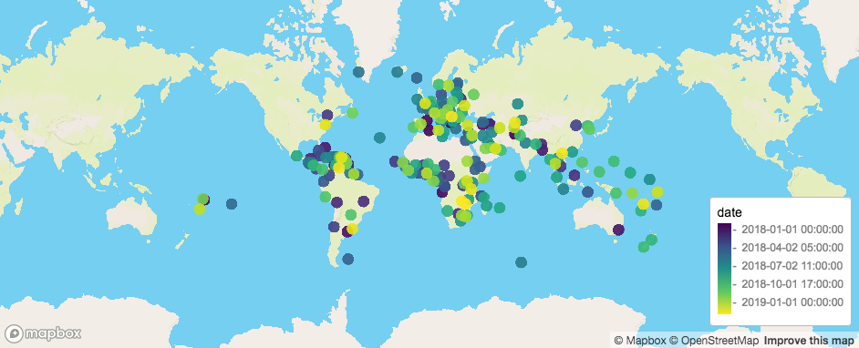

## Basic

In simple terms, if you want to add a legend to your map, set `legend = TRUE`. This will add a legend for either `fill_colour` or `stroke_colour` values (depending on which one the layer supports)

```{r eval = FALSE}

mapdeck() %>%
	add_scatterplot(
		data = capitals
		, lat = "lat", lon = "lon"
		, radius = 500000
		, fill_colour = "country"
		, legend = TRUE
	)


```


In more-complex-but-still-simple terms, if the layer supports multiple fill and/or strokes, and you only want to show one of them in the legend, you can use a list to specify which coloured variables are included, such as

```{r eval = FALSE}

url <- 'https://raw.githubusercontent.com/plotly/datasets/master/2011_february_aa_flight_paths.csv'
flights <- read.csv(url)
flights$id <- seq_len(nrow(flights))
flights$stroke <- sample(1:3, size = nrow(flights), replace = T)
flights$info <- paste0("<b>",flights$airport1, " - ", flights$airport2, "</b>")
flights$airline <- as.character( flights$airline )
flights$airport1 <- as.character( flights$airport1 )
flights$airport2 <- as.character( flights$airport2 )

mapdeck() %>%
	add_arc(
		data = flights
		, layer_id = "arc_layer"
		, origin = c("start_lon", "start_lat")
		, destination = c("end_lon", "end_lat")
		, stroke_from = "airport1"
		, stroke_to = "airport2"
		, stroke_width = "stroke"
		, tooltip = "info"
		, auto_highlight = TRUE
		, legend = list( stroke_from = TRUE, stroke_to = FALSE )
	)

```


## Formatting

There are two ways to format the legends

1. `legend_options` for controlling the appearance of the legend
2. `legend_format` for formatting the values in the legend

### Legend Options

In the `legend_options` argument you use a list to control the title and css of the legend

```{r eval = FALSE}

mapdeck() %>%
	add_arc(
		data = flights
		, layer_id = "arc_layer"
		, origin = c("start_lon", "start_lat")
		, destination = c("end_lon", "end_lat")
		, stroke_from = "airport1"
		, stroke_to = "airport2"
		, stroke_width = "stroke"
		, tooltip = "info"
		, auto_highlight = TRUE
		, legend = TRUE
		, legend_options = list(
			stroke_from = list( title = "Origin airport"), 
			stroke_to = list( title = "Destination"), 
			css = "max-height: 100px;" ## css applied to both stroke_from and stroke_to
		)
	)
```



### Legend Format

This argument lets you control the appearance of the values in the legend. Simply pass in a function to apply to the values. 


```{r eval = FALSE }

mapdeck() %>%
	add_polygon(
		data = melbourne
		, polyline = "polyline"
		, fill_colour = "AREASQKM"
		, legend = TRUE
		, legend_format = list( fill_colour = as.integer )
	)
```



### Formatting Dates

POSIX objects are a bit tricker. At the heart of mapdeck, all code is written in C++, and any time-zone attributes are lost from the R POSIXct object, and the underlying numeric data is converted to UTC. 

```{r eval = FALSE} 

df <- capitals
df$date <- seq(
	as.POSIXct("2018-01-01 00:00:00", tz = "Australia/Melbourne"), 
	as.POSIXct("2019-01-01 00:00:00", tz = "Australia/Melbourne"), 
	length.out = nrow(df)
	)

mapdeck() %>%
	add_scatterplot(
		data = df
		, lon = "lon", lat = "lat"
		, fill_colour = "date"
		, radius = 500000
		, legend = TRUE
	)

```


Notice the dates have been converted to UTC, and includes the `T` time-zone identifier. 

Therefore, if you want to convert the legend back to `Australia/Melbourne`, you need to use a function for this.

```{r eval = FALSE}
format_dates <- function( x ) {
		x <- as.POSIXct(x, tz = "UTC", format = "%Y-%m-%dT%H:%M:%S")
		attr( x, "tzone" ) <- "Australia/Melbourne"
		x <- as.character( x )
		x
}


mapdeck() %>%
	add_scatterplot(
		data = df
		, lon = "lon", lat = "lat"
		, fill_colour = "date"
		, radius = 500000
		, legend = TRUE
		, legend_format = list( fill_colour = format_dates )
	)

```


Note, also, the final `as.character()` call in the formatting function. This is because the legend is converted to JSON using `jsonify::to_json()`, which uses the same C++ code as mapdeck (in fact, it IS the c++ code mapdeck uses). So if the legend contains a POSIXct object after formatting, it will again be converted to UTC. 

## Manual Legends

If you want to create your own legend you can do so using `mapdeck_legend()`, which accepts `legend_elements` as its argument, creates the required JSON, which you can then use in the `legend` argument of any of the layers

```{r, eval = FALSE}

sf <- spatialwidget::widget_melbourne
sf$my_colour <- ifelse( substr(sf$SA2_NAME, 1, 1) == "A", "#00FF00FF", "#FF0000FF")

l1 <- legend_element(
	variables = c("Begins with A", "Doesn't begin with A")
	, colours = c("#00FF00FF", "#FF0000FF")
	, colour_type = "fill"
	, variable_type = "category"
)
js <- mapdeck_legend(l1)

mapdeck() %>%
	add_polygon(
		data = sf
		, fill_colour = "my_colour"
		, legend = js
	)

```

