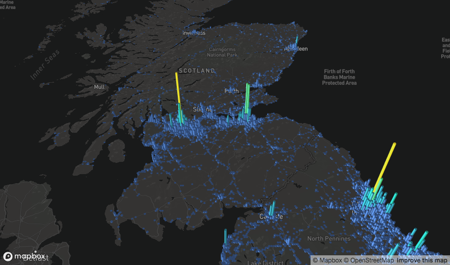

```{r setup, include = FALSE}
knitr::opts_chunk$set(
  collapse = TRUE,
  comment = "# ",
  eval = F
)
```

```{r packages, eval = TRUE, message = FALSE}
library(mapdeck)
```




# What is Mapdeck?

Mapdeck is a combination of [Mapbox](https://docs.mapbox.com/mapbox-gl-js/api/) and [Deck.gl](https://deck.gl/)


# Why did you build it?

Because Deck.gl is one of the most user-friendly WebGL javascript libraries and can produce some beautiful maps. And it integrates nicely with Mapbox. 


# The basics

You need a [Mapbox Access Token](https://docs.mapbox.com/help/how-mapbox-works/access-tokens/) to load a map. Then call `mapdeck(token = token)` to give you a map

```{r, fig.width=6}
key <- 'abc'    ## put your own token here
mapdeck(token = key)
```

You can make your token available 'globally' to all `mapdeck()` calls by either

1. using `set_token()`, which sets the token as an `option`
2. having the token in your environment (e.g., using `Sys.setenv()` ) with the key one of "MAPBOX_TOKEN","MAPBOX_KEY","MAPBOX_API_TOKEN", "MAPBOX_API_KEY", "MAPBOX", "MAPDECK"

Here's an example using `set_token()`

```{r, eval = T}
set_token('abc')
mapdeck_tokens()
```


You can style the map using any [mapbox style](https://docs.mapbox.com/api/#styles) template styles, or you can [create one of your own](https://docs.mapbox.com/studio-manual/reference/styles/)

```{r, fig.width=6}
mapdeck(token = key, style = 'mapbox://styles/mapbox/dark-v9')
```

I've provided a convenience function to select one of the mapbox defined styles

```{r}
mapdeck_style(style = 'dark')
```


Once you have a map you can start adding layers through the various `add_*()` functions (there is an example of each one in this vignette).

All details about layers, colours, tips & tricks, etc, are here

- [layers](https://symbolixau.github.io/mapdeck/articles/layers.html)
- [colours](https://symbolixau.github.io/mapdeck/articles/colours.html)
- [legends](https://symbolixau.github.io/mapdeck/articles/legends.html)
- [tips & tricks](https://symbolixau.github.io/mapdeck/articles/tips_tricks.html)
- [benchmarks](https://symbolixau.github.io/mapdeck/articles/benchmarks.html)
- [issues](https://symbolixau.github.io/mapdeck/articles/issues.html)
