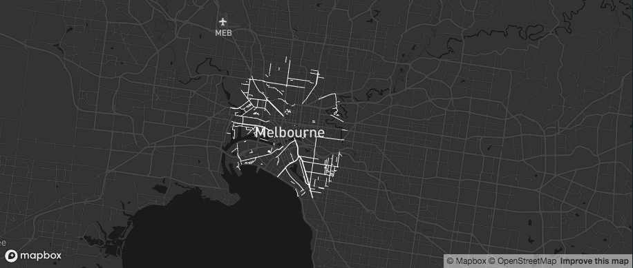
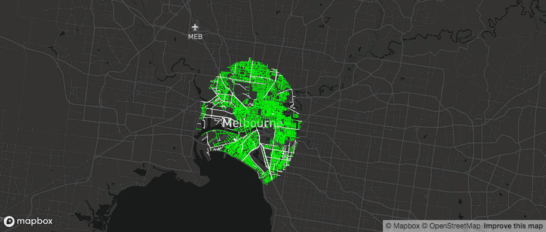

# Multiple layers

If you add multiple layers of the same type to a map, you need to supply a unique `layer_id` for each layer. If you don't, Deck.gl will get conflicted and will assume the last layer you plotted contains the most recent data you want to plot.

In this example, the first `add_path()` is setting roads of type "STREET" to green (#00FF00FF), and the second layer is setting those of type "ROAD" to white. However, notice only the white layer is plotted.

```r

mapdeck( style = mapdeck_style("dark") ) %>%
  add_path( 
    data = roads[ roads$ROAD_TYPE %in% "STREET",]
    , stroke_colour = "#00FF00FF" ) %>%
  add_path( 
    data = roads[ roads$ROAD_TYPE %in% "ROAD",]
    , stroke_colour = "#FFFFFFFF" )
  
```



Setting a `layer_id` (on one or both layers) solves this

```r

mapdeck( style = mapdeck_style("dark") ) %>%
  add_path( 
    data = roads[ roads$ROAD_TYPE %in% "STREET",]
    , stroke_colour = "#00FF00FF"
    , layer_id = "green" ) %>%
  add_path( 
    data = roads[ roads$ROAD_TYPE %in% "ROAD",]
    , stroke_colour = "#FFFFFFFF"
    )
  
```



# Shiny

## Updating the map

If you are dynamically adding and removing layers in a shiny app you should use `mapdeck_update()` inside an `observeEvent()` (or similar) function

```r
library(shiny)
library(shinydashboard)

ui <- dashboardPage(
	dashboardHeader()
	, dashboardSidebar(
		actionButton(inputId = "roads", label = "roads")
		, actionButton(inputId = "polygons", label = "polygons")
	)
	, dashboardBody(
		mapdeckOutput(outputId = "map")
	)
)

server <- function(input, output) {
	
	## initialise a map
	output$map <- renderMapdeck({
		mapdeck( location = c(144.9, -37), zoom = 5)
	})
	
	## use an observer to add and remove layers
	observeEvent({input$roads},{
		
		if ( input$roads %% 2 == 1 ) {
			
			mapdeck_update(map_id = "map") %>%
				add_path(
					data = roads
					, layer_id = "myRoads"
					, stroke_colour = "RIGHT_LOC"
					)
		} else {
		  mapdeck_update(map_id = "map") %>%
				clear_path(layer_id = "myRoads")
		}
	})
	
	observeEvent({input$polygons},{
		
		if ( input$polygons %% 2 == 1 ) {
			
			mapdeck_update(map_id = "map") %>%
				add_polygon(
					data = melbourne
					, layer_id = "myPolygon"
					, fill_colour = "SA2_NAME"
					)
		} else {
		  mapdeck_update(map_id = "map") %>%
				clear_polygon(layer_id = "myPolygon")
		}
	})
}

shinyApp(ui, server)
```

You will have noticed I've specified the `location` argument in the initial `mapdeck()` call...

# update_view

# sf objects

- subsetting requires `library(sf)` loaded

# colours

- if using a hex string it requires an alpha "#000000FF"
