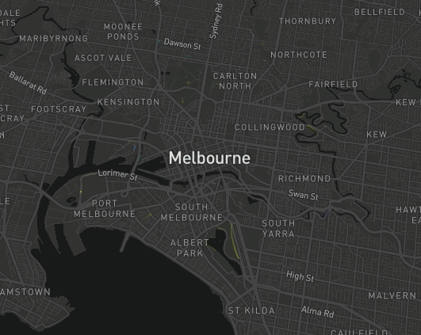

The trips layer requires an `sf` object with XYZM dimension, where Z is elevation and M is a timestamp

In this example I'm taking the `mapdeck::roads` data, and assigning a random timestamp to each coordinate point in the lines.

The timestamps have to be positive, and in sequential order. 

```r
library(sf)
library(data.table)

set_token( "MAPBOX_TOKEN" )
coords <- sf::st_coordinates( roads )
dt <- as.data.table( coords )

dt[, elev := 0]
dt[, seq := 1:.N, by = L1 ]
dt1 <- dt[ seq == 1]
dt1[, start_time := sample(1:100, size = .N, replace = T)]
dt[
	dt1[, .(L1, start_time)]
	, on = c("L1")
	, start_time := i.start_time
	]

dt[, time := start_time + seq ]
s <- dt[, min( time )]
e <- dt[, max( time )]

dt <- dt[
	, {
		geometry <- sf::st_linestring( x = matrix( c(X,Y,elev,time), ncol = 4 ))
		geometry <- sf::st_sf( geometry = sf::st_sfc( geometry ) )
	}
	, by = L1
	]

sfc <- dt$geometry
sf <- roads
sf$geometry <- sfc
```


```r
mapdeck(
	location = c(145, -37.8)
	, zoom = 10
	, style = mapdeck_style("dark")
) %>%
	add_trips(
		data = sf
		, stroke_colour = "ROAD_NAME"
		, start_time = s
		, end_time = e
		, trail_length = 50
	)
```


